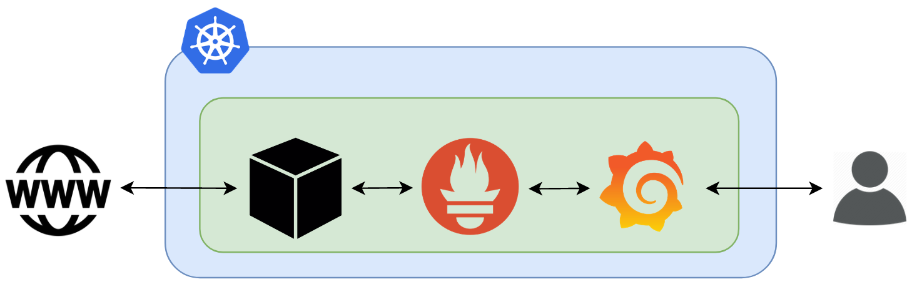
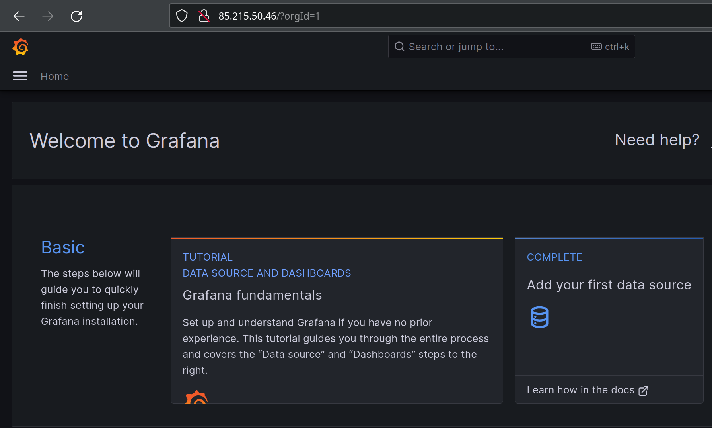
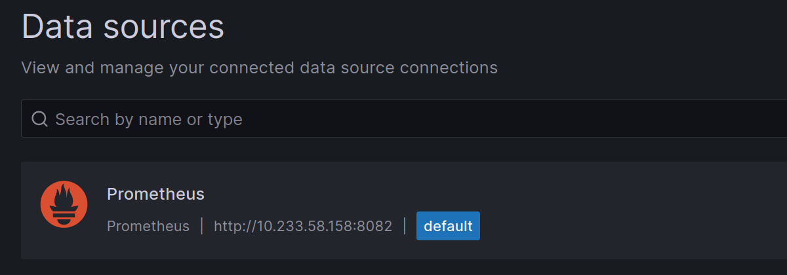
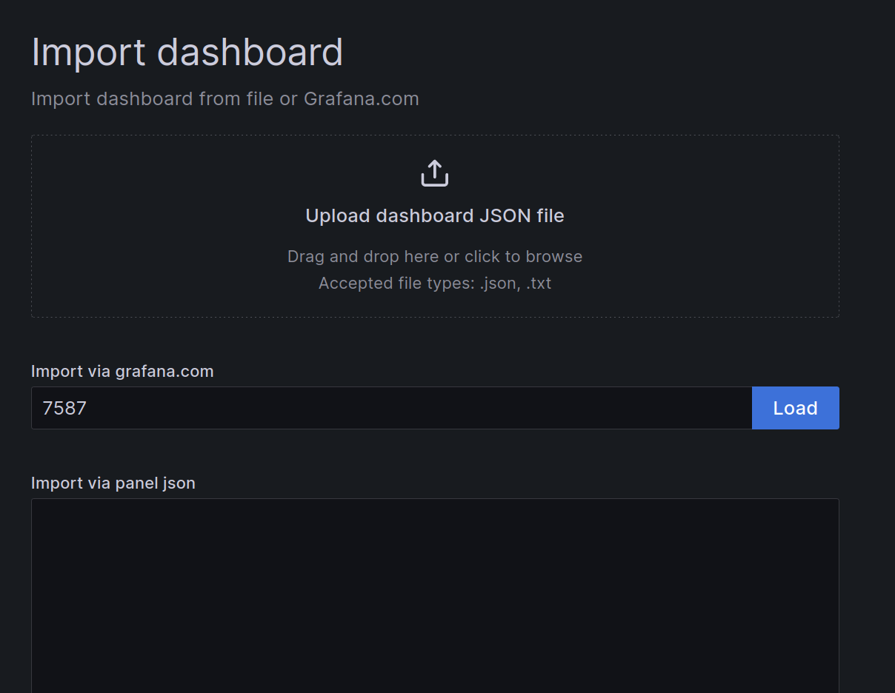
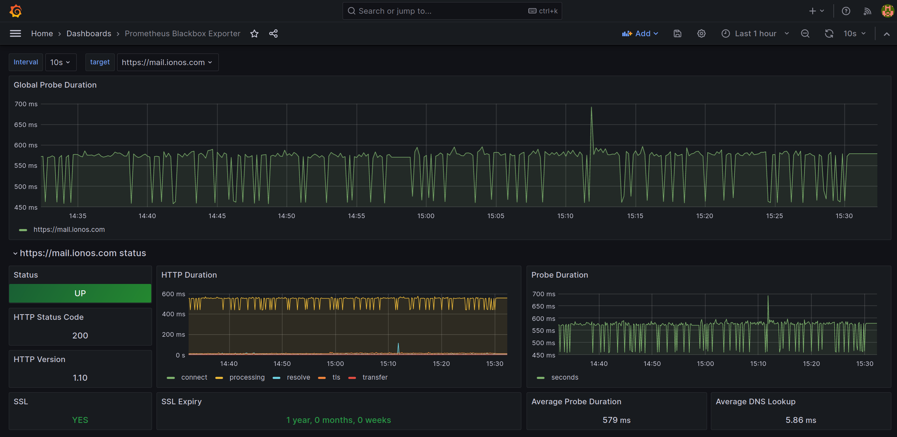

# Setting up a Monitoring Stack on top of K8s


## Deployment Overview

Within this documentation, our objective is to deploy a comprehensive monitoring stack comprising the Prometheus-BlackBox exporter, Prometheus TS-DB server, and Grafana component. The BlackBox exporter will specifically monitor the availability and performance of the "mail.ionos.com" website.




### Prerequisites 

Before proceeding with this deployment, it is imperative to meet the following requirements:

- An operational Kubernetes cluster.
- Access to the Kubernetes cluster through the use of `kubectl`.
- Installation of the [Helm](https://github.com/sourensam/ionos_project/blob/main/installing_helm.md) package.


### Monitoring stack deployment


**Creating Kubernetes namespace**

All components of the deployment will reside in the "monitoring" namespace. We create this namespace using the following command: 

```bash
kubectl create ns monitoring 
```


**Deploying Blackbox**

For this deployment, we require:

- A "configMap" containing Blackbox configurations.
- A "clusterIP" service to make the Blackbox process accessible throughout the cluster.
- A deployment for the primary Blackbox service.

All of these components are conveniently provided in a single Kubernetes manifest, as depicted below:

```yaml
apiVersion: v1  
kind: ConfigMap  
metadata:  
 name: blackbox-exporter-config  
 namespace: monitoring  
 labels:  
   k8s-app: blackbox-exporter  # will match to Service.metadata.labels.k8s-app 
data:  
 blackbox.yaml: |  
   modules:  
     http_2xx:  
       http:  
         no_follow_redirects: true  
         preferred_ip_protocol: ip4  
         valid_http_versions:  
         - HTTP/1.1  
         - HTTP/2.0  
         valid_status_codes: []  
       prober: http  
       timeout: 5s  
---  
kind: Service  
apiVersion: v1  
metadata:  
 name: blackbox-exporter  
 namespace: monitoring  
 labels:  
   k8s-app: blackbox-exporter  # pointing the svc "blackbox-exporter" 
spec:  
 type: ClusterIP  
 ports:  
   - name: http  
     port: 9115  
     protocol: TCP  
 selector:  
   k8s-app: blackbox-exporter  
  
---  
apiVersion: apps/v1  
kind: Deployment  
metadata:  
 name: blackbox-exporter  
 namespace: monitoring  
 labels:  
   k8s-app: blackbox-exporter  
spec:  
 replicas: 1  
 selector:  
   matchLabels:  
     k8s-app: blackbox-exporter  # pointing the svc "blackbox-exporter" 
 template:  
   metadata:  
     labels:  
       k8s-app: blackbox-exporter  
   spec:  
     restartPolicy: Always  
     containers:  
       - name: blackbox-exporter  
         image: "prom/blackbox-exporter"  
         imagePullPolicy: IfNotPresent  
         securityContext:  
           readOnlyRootFilesystem: true  
           runAsNonRoot: true  
           runAsUser: 1000  
         args:  
           - "--config.file=/config/blackbox.yaml"  
         resources:  
           {}  
         ports:  
           - containerPort: 9115  
             name: http  
         livenessProbe:  
           httpGet:  
             path: /health  
             port: http  
         readinessProbe:  
           httpGet:  
             path: /health  
             port: http  
         volumeMounts:  
           - mountPath: /config  
             name: config  
       - name: configmap-reload 
	     # it is a simple binary to trigger a reload when Kubernetes
	     # ConfigMaps or Secrets, mounted into pods, are updated.
	     # https://github.com/jimmidyson/configmap-reload 
         image: "jimmidyson/configmap-reload:v0.2.2"  
         imagePullPolicy: "IfNotPresent"  
         securityContext:  
           runAsNonRoot: true  
           runAsUser: 65534  
         args:  
           - --volume-dir=/etc/config  
           - --webhook-url=http://localhost:9115/-/reload  
         resources:  
           {}  
         volumeMounts:  
           - mountPath: /etc/config  
             name: config  
             readOnly: true  
     volumes:  # pointing the cm "blackbox-exporter-config"
       - name: config  
         configMap:  
           name: blackbox-exporter-config
```

* **Note**: Blackbox configuration offers numerous variations and options. However, for simplicity's sake, we configure it in the most straightforward manner possible.

```yaml
   modules:  
     http_2xx:  
       http:  
         no_follow_redirects: true  
         preferred_ip_protocol: ip4  
         valid_http_versions:  
         - HTTP/1.1  
         - HTTP/2.0  
         valid_status_codes: []  
       prober: http  
       timeout: 5s
```

And apply this context into kubernetes with:

```bash
kubectl apply -f blackbox.yaml
```


**Deploying Prometheus**

To deploy Prometheus, we need to create the following Kubernetes objects:

- A clusterRole and a ClusterRoleBindings with the necessary access configurations.
- A persistentVolume to store Prometheus TS-DB data persistently.
- A configMap to store the Prometheus configuration file (prometheus.yaml).
- A deployment for the Prometheus server process.
- Two services to make Prometheus accessible both internally and externally.


**_clusterRole.yaml_** 

```yaml
apiVersion: rbac.authorization.k8s.io/v1  
kind: ClusterRole  
metadata:  
 name: prometheus  
rules:  
- apiGroups: [""]  
 resources:  
 - nodes  
 - nodes/proxy  
 - services  
 - endpoints  
 - pods  
 verbs: ["get", "list", "watch"]  
- apiGroups:  
 - extensions  
 resources:  
 - ingresses  
 verbs: ["get", "list", "watch"]  
- nonResourceURLs: ["/metrics"]  
 verbs: ["get"]  
---  
apiVersion: rbac.authorization.k8s.io/v1  
kind: ClusterRoleBinding  
metadata:  
 name: prometheus  
roleRef:  
 apiGroup: rbac.authorization.k8s.io  
 kind: ClusterRole  
 name: prometheus  
subjects:  
- kind: ServiceAccount  
 name: default  
 namespace: monitoring
```

Apply this object: 

```bash
kubectl apply -f clusterRole.yaml
```


**_pvc_prometheus.yaml_**

On the IONOS Managed Kubernetes platform, predefined storageClasses are available for use. 

```bash
$ kubectl get sc
NAME                             PROVISIONER       
ionos-enterprise-hdd (default)   cloud.ionos.com 
ionos-enterprise-ssd             cloud.ionos.com 
```

When utilizing storageClasses, there's no requirement to manually create persistentVolumes (PVs). The only essential object to create is a persistentVolumeClaim (PVC), as demonstrated below:

```yaml
apiVersion: v1  
kind: PersistentVolumeClaim  
metadata:  
 name: prometheus-pvc  
 namespace: monitoring  
spec:  
 accessModes:  
   - ReadWriteOnce  
 storageClassName: ionos-enterprise-hdd   ## the storageClass name to be used
 resources:  
   requests:  
     storage: 20Gi 
```

Apply the object:

```bash
kubectl apply -f pvc_prometheus.yaml
```


**_prometheus-config.yaml_**

The configMap representing the _prometheus.yaml_ configuration file:

```yaml
apiVersion: v1  
kind: ConfigMap  
metadata:  
 name: prometheus-server-conf  
 namespace: monitoring  
 labels:  
   name: prometheus-server-conf  
data:  
 prometheus.rules: |-  
   groups:  
   - name: Infrastructure alerts  
     rules:  
     - alert: High Pod Memory  
       expr: sum(container_memory_usage_bytes) > 1  
       for: 1m  
       labels:  
         severity: page  
       annotations:  
         summary: High Memory Usage  
 prometheus.yml: |-  
   global:  
     scrape_interval: 5s  
     evaluation_interval: 5s  
   rule_files:  
     - /etc/prometheus/prometheus.rules  
   alerting:  
     alertmanagers:  
     - scheme: http  
       static_configs:  
       - targets:  
         - "alertmanager.monitoring.svc.cluster.local:9093"  
   scrape_configs:  
     - job_name: 'node-exporter'  
       kubernetes_sd_configs:  
         - role: endpoints  
       relabel_configs:  
       - source_labels: [__meta_kubernetes_endpoints_name]  
         regex: 'node-exporter'  
         action: keep  
     - job_name: 'kubernetes-apiservers'  
       kubernetes_sd_configs:  
       - role: endpoints  
       scheme: https  
       tls_config:  
         ca_file: /var/run/secrets/kubernetes.io/serviceaccount/ca.crt  
       bearer_token_file: /var/run/secrets/kubernetes.io/serviceaccount/token  
       relabel_configs:  
       - source_labels: [__meta_kubernetes_namespace, __meta_kubernetes_service_name, __meta_kubernetes_endpoint_port_name]  
         action: keep  
         regex: default;kubernetes;https  
     - job_name: 'kubernetes-nodes'  
       scheme: https  
       tls_config:  
         ca_file: /var/run/secrets/kubernetes.io/serviceaccount/ca.crt  
       bearer_token_file: /var/run/secrets/kubernetes.io/serviceaccount/token  
       kubernetes_sd_configs:  
       - role: node  
       relabel_configs:  
       - action: labelmap  
         regex: __meta_kubernetes_node_label_(.+)  
       - target_label: __address__  
         replacement: kubernetes.default.svc:443  
       - source_labels: [__meta_kubernetes_node_name]  
         regex: (.+)  
         target_label: __metrics_path__  
         replacement: /api/v1/nodes/${1}/proxy/metrics        
     - job_name: 'kubernetes-pods'  
       kubernetes_sd_configs:  
       - role: pod  
       relabel_configs:  
       - source_labels: [__meta_kubernetes_pod_annotation_prometheus_io_scrape]  
         action: keep  
         regex: true  
       - source_labels: [__meta_kubernetes_pod_annotation_prometheus_io_path]  
         action: replace  
         target_label: __metrics_path__  
         regex: (.+)  
       - source_labels: [__address__, __meta_kubernetes_pod_annotation_prometheus_io_port]  
         action: replace  
         regex: ([^:]+)(?::\d+)?;(\d+)  
         replacement: $1:$2  
         target_label: __address__  
       - action: labelmap  
         regex: __meta_kubernetes_pod_label_(.+)  
       - source_labels: [__meta_kubernetes_namespace]  
         action: replace  
         target_label: kubernetes_namespace  
       - source_labels: [__meta_kubernetes_pod_name]  
         action: replace  
         target_label: kubernetes_pod_name  
        
     - job_name: 'kube-state-metrics'  
       static_configs:  
         - targets: ['kube-state-metrics.kube-system.svc.cluster.local:8080']  
     - job_name: 'kubernetes-cadvisor'  
       scheme: https  
       tls_config:  
         ca_file: /var/run/secrets/kubernetes.io/serviceaccount/ca.crt  
       bearer_token_file: /var/run/secrets/kubernetes.io/serviceaccount/token  
       kubernetes_sd_configs:  
       - role: node  
       relabel_configs:  
       - action: labelmap  
         regex: __meta_kubernetes_node_label_(.+)  
       - target_label: __address__  
         replacement: kubernetes.default.svc:443  
       - source_labels: [__meta_kubernetes_node_name]  
         regex: (.+)  
         target_label: __metrics_path__  
         replacement: /api/v1/nodes/${1}/proxy/metrics/cadvisor  
        
     - job_name: 'kubernetes-service-endpoints'  
       kubernetes_sd_configs:  
       - role: endpoints  
       relabel_configs:  
       - source_labels: [__meta_kubernetes_service_annotation_prometheus_io_scrape]  
         action: keep  
         regex: true  
       - source_labels: [__meta_kubernetes_service_annotation_prometheus_io_scheme]  
         action: replace  
         target_label: __scheme__  
         regex: (https?)  
       - source_labels: [__meta_kubernetes_service_annotation_prometheus_io_path]  
         action: replace  
         target_label: __metrics_path__  
         regex: (.+)  
       - source_labels: [__address__, __meta_kubernetes_service_annotation_prometheus_io_port]  
         action: replace  
         target_label: __address__  
         regex: ([^:]+)(?::\d+)?;(\d+)  
         replacement: $1:$2  
       - action: labelmap  
         regex: __meta_kubernetes_service_label_(.+)  
       - source_labels: [__meta_kubernetes_namespace]  
         action: replace  
         target_label: kubernetes_namespace  
       - source_labels: [__meta_kubernetes_service_name]  
         action: replace  
         target_label: kubernetes_name  
        
     - job_name: kubernetes-nodes-cadvisor  
       scrape_interval: 10s  
       scrape_timeout: 10s  
       scheme: https  # remove if you want to scrape metrics on insecure port  
       tls_config:  
         ca_file: /var/run/secrets/kubernetes.io/serviceaccount/ca.crt  
       bearer_token_file: /var/run/secrets/kubernetes.io/serviceaccount/token  
       kubernetes_sd_configs:  
         - role: node  
       relabel_configs:  
         - action: labelmap  
           regex: __meta_kubernetes_node_label_(.+)  
         - target_label: __address__  
           replacement: kubernetes.default.svc:443  
         - source_labels: [__meta_kubernetes_node_name]  
           regex: (.+)  
           target_label: __metrics_path__  
           replacement: /api/v1/nodes/${1}/proxy/metrics/cadvisor  
       metric_relabel_configs:  
         - action: replace  
           source_labels: [id]  
           regex: '^/machine\.slice/machine-rkt\\x2d([^\\]+)\\.+/([^/]+)\.service$'  
           target_label: rkt_container_name  
           replacement: '${2}-${1}'  
         - action: replace  
           source_labels: [id]  
           regex: '^/system\.slice/(.+)\.service$'  
           target_label: systemd_service_name  
           replacement: '${1}'  
     - job_name: 'kube-api-blackbox'  
       metrics_path: /probe  
       params:  
         module: [http_2xx]  
       static_configs:  
       - targets:  
         - https://mail.ionos.com  
         - https://www.php.net  
       relabel_configs:  
       - source_labels: [__address__]  
         target_label: __param_target  
       - source_labels: [__param_target]  
         target_label: instance  
       - target_label: __address__  
         replacement: 10.233.42.137:9115
```

**Note:** In this file we have set 2 hosts to be monitored:
```yaml
     - job_name: 'kube-api-blackbox'  
       metrics_path: /probe  
       params:  
         module: [http_2xx]  
       static_configs:  
       - targets:  
         - https://mail.ionos.com  
         - https://www.php.net 
```

Applying this object: 

```bash
kubectl apply -f prometheus-config.yaml
```


**_prometheus-deployment.yaml_**

This is the deployment manifest:

```yaml
apiVersion: apps/v1  
kind: Deployment  
metadata:  
 name: prometheus-deployment  
 namespace: monitoring  
 labels:  
   app: prometheus-server  
spec:  
 replicas: 1  
 selector:  
   matchLabels:  
     app: prometheus-server  
 template:  
   metadata:  
     labels:  
       app: prometheus-server  
   spec:  
     volumes:  
       - name: prometheus-config-volume  
         configMap:  
           defaultMode: 420  
           name: prometheus-server-conf  
  
       - name: prometheus-storage-volume  
         persistentVolumeClaim:  
           claimName: prometheus-pvc # Name of the PVC to create/use  
  
     initContainers:    
	     # This init-container is used for setting the appropriate
	     # permission for the "/prometheus" directory inside the container 
       - name: fix-permissions  
         image: busybox  
         command: ['sh', '-c', 'chown -R 65534:65534 /prometheus']  
         volumeMounts:  
           - name: prometheus-storage-volume  
             mountPath: /prometheus/  
  
     containers:  
       - name: prometheus  
         image: prom/prometheus  
         args:  
           - "--config.file=/etc/prometheus/prometheus.yml"  
           - "--storage.tsdb.path=/prometheus/"  
         ports:  
           - containerPort: 9090  
         volumeMounts:  
           - name: prometheus-config-volume  
             mountPath: /etc/prometheus/  
           - name: prometheus-storage-volume  
             mountPath: /prometheus/
```

Apply the object: 

```bash
kubectl apply -f prometheus-deployment.yaml
```

for verification: 

```bash
kubectl get pods -n monitoring -o wide 
kubectl get all -n monitoring 
```


**_prometheus-service.yaml_**

Now, it's time to set up internal and external services for Prometheus container communications.

```yaml
apiVersion: v1  
kind: Service  
metadata:  
 name: prometheus-service-external  
 namespace: monitoring  
spec:  
 selector:    
   app: prometheus-server  
 type: LoadBalancer     
 ports:  
   - port: 8081  
     targetPort: 9090      
---  
apiVersion: v1  
kind: Service  
metadata:  
 name: prometheus-service-internal  
 namespace: monitoring     
spec:  
 selector:    
   app: prometheus-server  
 ports:  
   - port: 8082  
     targetPort: 9090
```

   - **Note:** If you don't need external access to the Prometheus web interface, you can omit creating the LoadBalancer external service. Instead, you can temporarily access it from outside using the _kubectl portforward_ feature.

Applying the service objects: 

```bash
kubectl apply -f prometheus-service.yaml
```

For verification: 

```bash
kubectl get svc -n monitoring
```

Find the TCP socket the service has been expose and call it via a web browser or using "curl" command. 


**Deploying Grafana**

In this scenario, we will use Helm to deploy Grafana. To customize Grafana to our environment, we'll begin by editing the "values.yaml" file associated with the Grafana service.

```bash
vim values.yaml
```

This is the default configuration of the file "values.yaml" offered by the official Grafana's GitHub page: 
[Grafana GitHub](https://github.com/grafana/helm-charts/blob/main/charts/grafana/values.yaml)

But change some part of this file as follows:

- Making the service type as a LoadBalancer:

```yaml
service:  
 enabled: true  
 type: LoadBalancer   # we want the grafana web interface to be publicl
					  # accessible
 port: 80  
 targetPort: 3000
```

- Deploy the pod on a persistent volume storage: 

```yaml
persistence:  
 type: pvc  
 enabled: true
```

- Defining the prometheus as the DataSource:

```yaml
datasources:
  datasources.yaml:
    apiVersion: 1
    datasources:
    - name: Prometheus
      type: prometheus
      url: http://10.233.58.158:8082 # the port "8082" is the of the service
								     # "prometheus-service-internal"
      access: proxy
      isDefault: true
```


Now, it's time to deploy Grafana using Helm:

```bash
helm repo add grafana https://grafana.github.io/helm-charts
```

```bash
Helm repo update
```

And finally Deploy Grafana using this attributes: 

```bash
helm install grafana grafana/grafana \
  --namespace monitoring \
  --set persistent.storageClassName="ionos-enterprise-hdd" \
  --set persistent.enabled=true \
  --set adminPassword="adminPassword" \
  --values ./values.yaml \
  --set service.type=LoadBalancer
```

- persistent.storageClassName: We the IONOS predefined kubernetes storageClass
- persistent.enabled: By setting to "true" we enable persistentVolume for Grafana POD
- adminPassword: The grafana admin password

**Note:** Certain arguments used in the `helm install` command have also been configured in the "values.yaml" file. Their inclusion in the command is primarily for accommodating various command variations.

----

**Accessing the Grafana Dashboard**

This is the command to find the IP socket for Grafana dashboard:

```bash
$ kubectl  get svc -n monitoring
NAME      TYPE           CLUSTER-IP      EXTERNAL-IP    PORT(S
grafana   LoadBalancer   10.233.28.59    85.215.50.46   80:31634/TCP
```




**Defining the data-source**

From this URL you can get to the Grafana DataSource configurations: 
_http://<Grafana_Address>/connections/datasources _

If you've correctly configured the Default DataSource in the "values.yaml" file, it will be displayed as shown in the picture below:




**BlackBox Exporter Dashboards**

The BlackBox exporter provides pre-built dashboards that you can download from [Grafana-Dashboards](https://www.google.com/url?sa=t&rct=j&q=&esrc=s&source=web&cd=&cad=rja&uact=8&ved=2ahUKEwjx3OaIteuBAxXcg_0HHS5HA_cQFnoECBQQAQ&url=https%3A%2F%2Fgrafana.com%2Fgrafana%2Fdashboards%2F&usg=AOvVaw1D7tT8dvF0qtHQ7-VCvgdM&opi=89978449).

We will be importing the dashboard with the ID "7587."

You can access the configuration page for this import by visiting:

* http://<Grafana_Address>/dashboard/import



And Load: 




